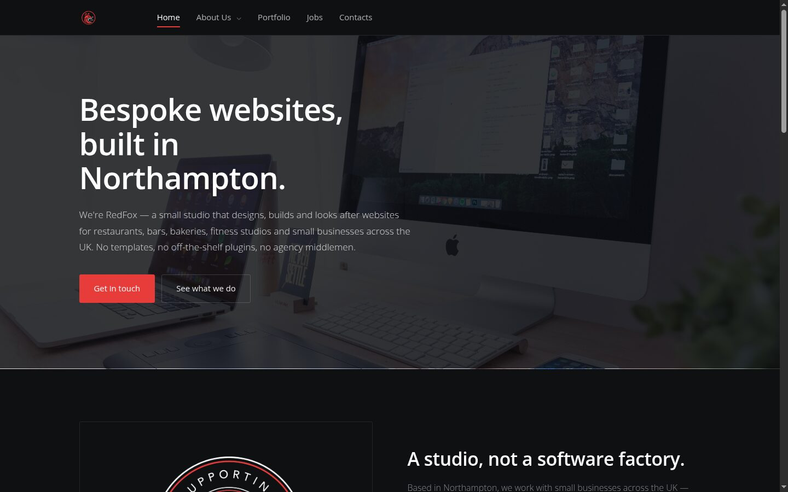
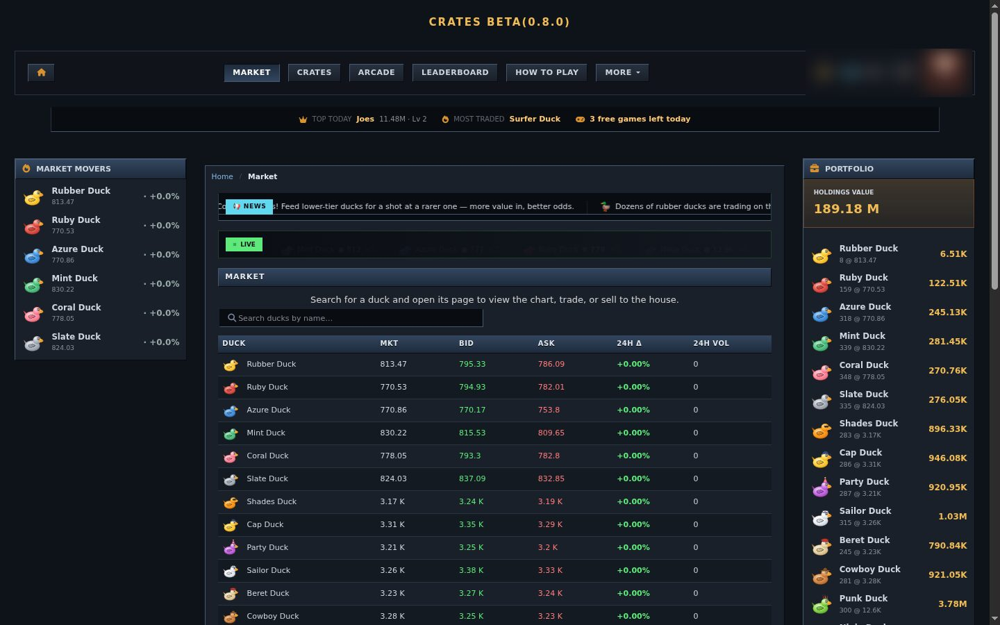

<div align="center">



<a href="https://josephcreasy.co.uk"></a>
<a href="https://redfoxss.co.uk"></a>
<a href="https://cratess.com"></a>


<br/><br/>


</div>

<br/>

> I build the whole thing: the product, the server it runs on, and the business around it.
> Founder of **RedFox**, maker of **Cratess**, and I write engines, simulators and AI agents for fun.

## ▸ in production

<table>
<tr>
<td width="50%" valign="top">

<a href="https://redfoxss.co.uk"></a>

### 🦊 [RedFox](https://redfoxss.co.uk)
**My web agency, running on a CMS I wrote.** A multi-tenant, Shopify-style platform:
one PHP codebase serves every client site with its own theme, blocks, admin, shop,
bookings and contact forms, plus per-tenant CSP, rate limiting and CSRF.
**30+ sites** built on it. I run the hosting and mail myself.

`PHP` `MariaDB` `Docker` `Apache` `self-hosted mail`

</td>
<td width="50%" valign="top">

<a href="https://cratess.com"></a>

### 🦆 [Cratess](https://cratess.com)
**A free browser stock-market game, with rubber ducks.** A real **order-book market**
(bids, asks, spreads) with NPC market makers, crates across **7 rarity tiers**, fusion,
auctions, clans, gifting, friends/chat, daily streaks, arcade mini-games and Stripe
payments. Live now, [go play it](https://cratess.com).

`PHP MVC` `MariaDB` `Stripe` `cron-driven NPC traders`

</td>
</tr>
</table>

## ▸ built for fun (the hard way)

<table>
<tr>
<td width="33%" valign="top">

### 🔫 [hardpoint](https://github.com/Jammore1203/hardpoint)
A 2002-console-style multiplayer arena FPS in **28k lines of Rust**. 12 maps, 5 modes,
25 weapons, bots that play the objective, authoritative UDP netcode.
**Every texture, mesh, sound and music track is generated in code.** No asset folder.

</td>
<td width="33%" valign="top">

### 🪰 [flybrain-trader](https://github.com/Jammore1203/flybrain-trader)
A **complete fruit-fly brain** (FlyWire: 138,639 neurons, 15M synapses) simulated
on the GPU, rewarded with dopamine for good trades. A population **evolves** on a year
of BTC history, and the champion trades live.

</td>
<td width="33%" valign="top">

### 🤖 [jarvis](https://github.com/Jammore1203/jarvis)
My personal AI agent on the **Claude Agent SDK**. Lives in Telegram, talks back with
local TTS, reads mail/calendar/location, and keeps an Obsidian vault as memory.
It also **rewrites its own self-model**.

</td>
</tr>
<tr>
<td width="33%" valign="top">

### 🔁 [git-autosync](https://github.com/Jammore1203/git-autosync)
Hourly commit+push on a systemd timer, which **refuses to leak**: secret scanning,
per-repo denylists, size caps, desktop alerts.

</td>
<td width="33%" valign="top">

### 🎨 [dotfiles](https://github.com/Jammore1203/dotfiles)
Gruvbox everything on Arch + Plasma. kitty, starship, a hand-tuned EQ for my
headphones, and K95 G-key macros.

</td>
<td width="33%" valign="top">

### 👾 [pacman](https://github.com/Jammore1203/pacman)
Pac-Man, but with guns. Generated maps, a hotbar and a leaderboard, in vanilla JS.

</td>
</tr>
</table>

## ▸ `cat joe.rs`

```rust
pub struct Joe {
    based_in:   &'static str,
    runs:       [&'static str; 2],
    daily:      Vec<&'static str>,
    currently:  &'static str,
    philosophy: &'static str,
}

impl Default for Joe {
    fn default() -> Self {
        Joe {
            based_in:   "UK 🇬🇧",
            runs:       ["RedFox Software Solutions", "Cratess"],
            daily:      vec!["Rust", "Python", "PHP", "C#", "JS", "Bash", "SQL"],
            currently:  "getting RedFox clients + teaching an agent to be useful",
            philosophy: "if it doesn't run in production, it doesn't count",
        }
    }
}
```

## ▸ stack

<div align="center">


<br/>


</div>

## ▸ numbers

<div align="center">


<br/>

<br/>

</div>

## ▸ lately

<!--START_SECTION:activity-->
<!--END_SECTION:activity-->

<div align="center">


<sub><code>:wq</code></sub>

</div>
